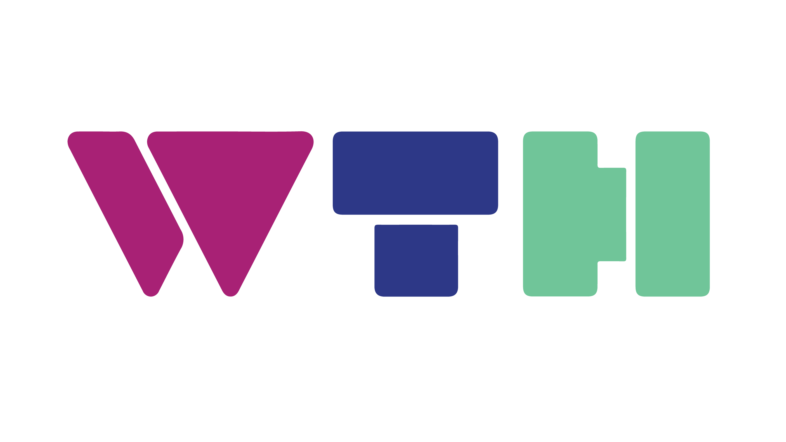

# SUTD What The Hack Automation Slack Bot

  

This Slack bot assists with administration, registration and judging for the purposes of SUTD What The Hack.

This codebase is made open to the public to prove that the score processing during judging is not rigged. 😉

## Table of Contents

- [Description](#description)
- [Installation](#installation)
- [Slack App Configuration](#slack-app-configuration)
- [Documentation](#documentation)
- [Acknowledgements](#acknowledgements)
- [TODO](#todo)

## Description

For the Slack bot side, we are using the Slackers Python Library, which follows the Pydantic philosophy. We built the Slack bot from the ground up (quite low-level) instead of using certain bot frameworks that currently already exist since it provides us with more flexibility with the whole FastAPI server setup and database management (considering that Slack's API changes quite rapidly). We are using FastAPI equipped with an ASGI server since it provides easier asynchronous management and speedier service for the Slack bot (by using Starlette and Uvicorn). Thus, please take note that at the moment, Windows does not support `uvloop`, which is used by this Slack bot.

This bot uses SQLAlchemy for the database side. This is just nice since FastAPI integrates nicely with SQLAlchemy. It may be replaced by any equivalent SQL database (feel free to modify `dbhelper.py`). It is also possible to generate an SQLAlchemy model from an existing database by using `sqlacodegen`. Data is collected through Microsoft Forms (due to PDPA reasons) and stored in a local SUTD server. A copy will be used in an AWS database server to be used by the bot.

Since this bot is only for our private Slack workspace (and not for public distribution), we do not need to use an HTTPS certificate (take note that Slack does not allow self-signed certificates for an HTTPS-based Request URL).

## Installation

After cloning this repo, just populate the necessary constants in [`settings.py`](./app/settings.py) and run [`deploy.sh`](./scripts/deploy.sh) from the [`scripts`](./scripts) folder as the current working directory before the hackathon starts to initialize all configurations. It provides an automated setting-up of:

- The initialization of the isolated Python virtual environment
- The required Python dependencies needed to run the bot properly
- The SQL database and its corresponding configurations
- The bot server configuration files & environment variables
- The execution of the bot's code

Post-hackathon, do a proper clean-up by running [`shutdown.sh`](./scripts/shutdown.sh), also from the [`scripts`](./scripts) folder as the current working directory.

## Slack App Configuration

- Settings:
  _SUTD WTH Bot - Automated service provider for SUTD What The Hack_

- Features:
  1. @sutdwthbot is always shown as online
  2. Both OAuth Access Token and Bot User OAuth Access Token are utilized
  3. `Messages Tab` enabled
  4. `Incoming Webhooks` activated (with only one existing `Webhook URL`)
  5. `Interactivity` enabled with the appropriate Request URL
  6. `Slash Commands` enabled for the respective commands
  7. `Bot Token Scopes`:

      * `channels:history`
      * `channels:read`
      * `chat:write`
      * `commands`
      * `files:read`
      * `files:write`
      * `groups:history`
      * `groups:read`
      * `im:history`
      * `im:read`
      * `im:write`
      * `incoming-webhook`
      * `links:read`
      * `links:write`
      * `mpim:history`
      * `mpim:read`
      * `mpim:write`
      * `remote_files:read`
      * `remote_files:share`
      * `remote_files:write`
      * `team:read`
      * `users:read`
      * `users:read.email`
      * `users:write`

  8. `User Token Scopes`:

      * `chat:write`

  9. `Events` enabled with the appropriate Request URL and subscribed to these corresponding bot events:
  
      * `message.channels`
      * `message.groups`
      * `message.im`
      * `message.mpim`

## Documentation

List of features that this bot provides:

- Judging workflow for judges
- Score editing for judges
- Overall leaderboard view by main organizer (WIP)

Available slash commands to be used:

| General Commands | Description |
| --- | --- |
| `/start` | Start the bot! 🤖 |

| Organizer Commands | Description |
| --- | --- |
| `/leaderboard` | Display the leaderboard 🏅 |
| `/viewdb` | Display an overall view of the whole database (WIP) |

| Judge Commands | Description |
| --- | --- |
| `/judge` | Begin judging sequence 👨‍⚖️ |
| `/edit` | Edit previous judging decision 📝 |
| `/cancel` | Abandon current conversation ❌ |
| `/summary` | View scoring progress so far 📄 |

Directory listing:

- `app`
  - `main.py`: Code command center
  - `config.py`: Global variables holders
  - `settings.py`: Credentials and necessary tokens
  - `databases`
    - `firebaser.py`: Cloud Firestore helper functions
    - `dbhelper.py`: SQLAlchemy helper functions
  - `handlers`
    - `editing`: Command handlers that are related to editing purposes
    - `judging`: Command handlers that are related to judging purposes
    - `utils`: Command handlers that are related to other miscellaneous purposes
    - `viewing`: Command handlers that are related to database viewing purposes
- `assets`: Other useful assets
- `scripts`: Folder of useful scripts
- `tests`: Test package

`__init__.py` files were added to initialize the different folders as modules.

## Acknowledgements

SUTD What The Hack Automation Crew:

- [@TenzinCHW](https://github.com/TenzinCHW)
- [@SolsticeDante](https://github.com/SolsticeDante)
- [@piroton](https://github.com/piroton)
- [@FolkLoreee](https://github.com/FolkLoreee)
- [@Cawinchan](https://github.com/Cawinchan)
- [@eesong](https://github.com/eesong)

Useful Documentations:

- [Official Slack API Documentation](https://api.slack.com)
- [Slack Python SDK](https://github.com/slackapi/python-slackclient)
- [Slack Webhook for FastAPI](https://github.com/uhavin/slackers)
- [Slack Events API Python Adapter](https://github.com/slackapi/python-slack-events-api)
- [Python Async Slack API Library](https://github.com/pyslackers/slack-sansio/)
- [slackApiDoc by ErikKalkoken](https://github.com/ErikKalkoken/slackApiDoc)

## TODO

1. Fix the issue whereby the `trigger_id` is occasionally expired (too slow response?) and catch server connection problems (`"Oops! Something went wrong."`) to prevent duplicate score submissions.

2. Add the capability for the main organizer to have an overall view over the whole backend SQL database (`/viewdb` slash command).

3. Add the capability for the judge to modify a specific score (using buttons on the summary table).

4. Make `JUDGE_LIST` and `CATEGORY_LIST` dynamic (since these changes every year). Possible to integrate this with setup scripts (and database structure).

5. Create different wrappers (one for each payload type) to check whether `user_id` is in `JUDGE_LIST` or not.

6. Improve documentation and unit testing coverage.

7. Incorporate document preparation and registration features for both participating teams and judges (later development phase).

Cheers!

&mdash;⭐&mdash;

<i>Crafted, designed and built with ❤️ by <a href="https://github.com/jamestiotio">@jamestiotio</a> in Singapore. (◕‿◕✿)</i>

